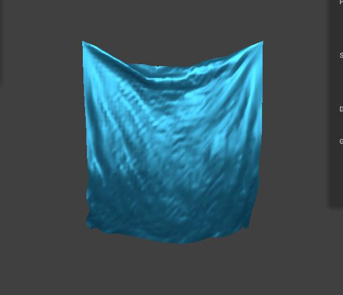
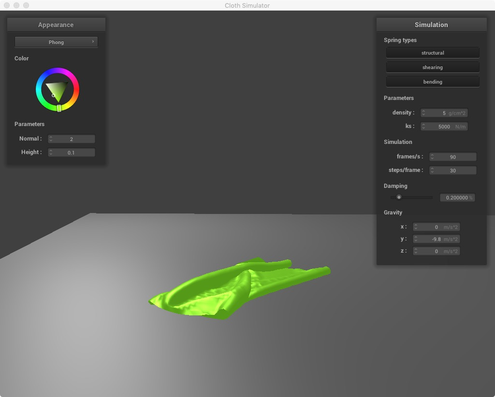
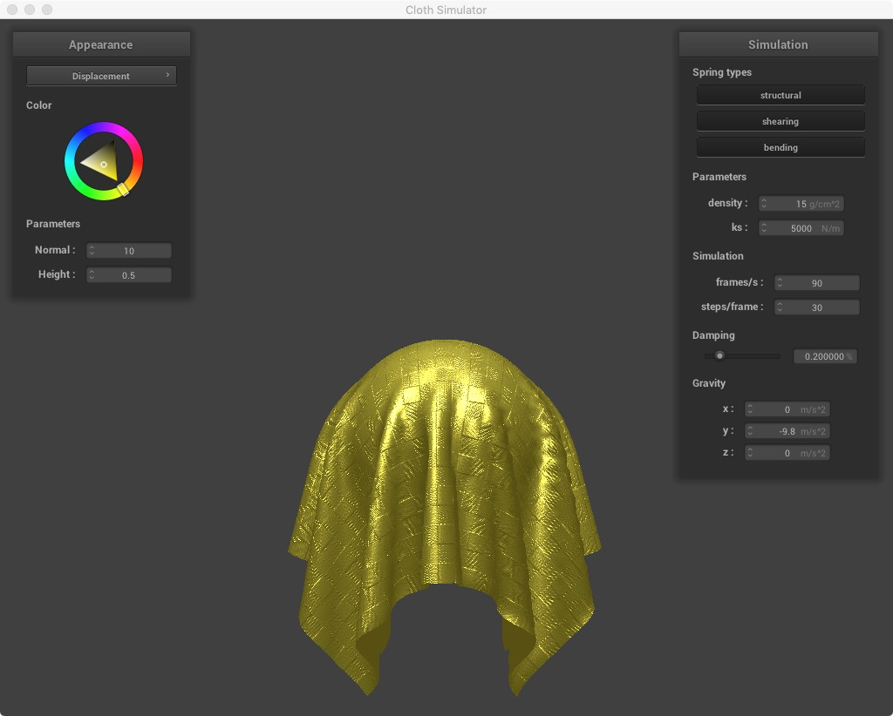

# Cloth-Simulator
A real-time cloth simulator using point masses and springs system. 

 

## Part 1: Masses and springs

Evenly spaced grid of point masses and then connected them by strings. Spring has three types, STRUCTURAL, SHEARING, BENDING. 

  

 

## Part 2: Simulation via numerical integration

### Extension

The constant ks controls the extension of the cloth.The larger the ks is, the more flat the cloth looks like. 

Small ks:

Large ks:

### Density

The constant density controls the gravity of the cloth. By increasing the density, the wrinkle part of the cloth is pulled down more by gravity. 

Small density:

  

Large density:

### Damping

Damping constant controls the oscillation of the spring force. The smaller the damping constant, the longer the cloth stay oscillated and moving. 

Small damping:

      

 

Large damping:

      

 

## Part 3: Handling collisions with other objects

Cloth on sphere

 

Cloth on plane

 

## Part 4: Handling self-collisions

      

 

## Part 5: Shaders

### Blinn-Phong Shading

### Texture Shading

### Displacement and Bump Mapping

  

### Environment-mapped Reflections

